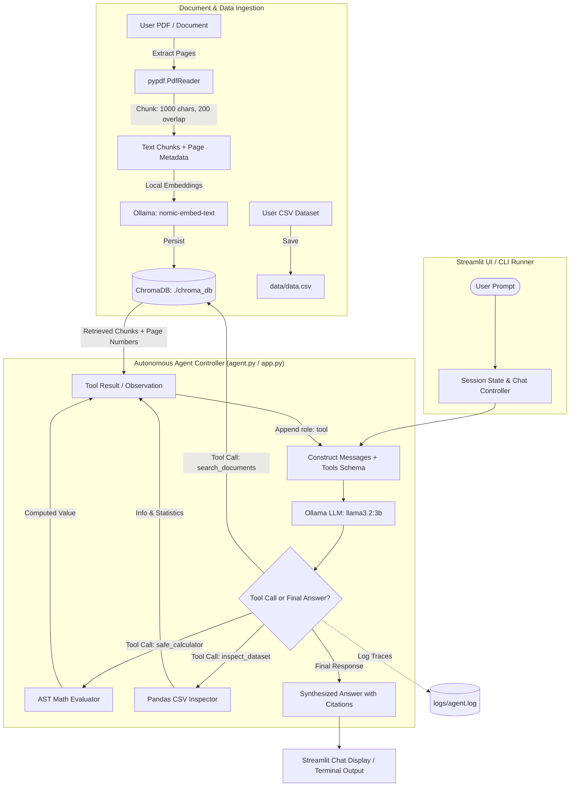

# Offline AI Agent 🤖

> A privacy-first, 100% offline autonomous AI agent powered by Ollama and ChromaDB that runs locally on your machine with zero cloud API dependencies.

---

## 📖 Overview

**Offline AI Agent** solves the data privacy and vendor lock-in challenges of cloud-based AI by executing entire agentic reasoning workflows locally. Leveraging **Ollama** (`llama3.2:3b`) for language reasoning and **ChromaDB** with `nomic-embed-text` embeddings for vector storage, it performs document retrieval-augmented generation (RAG), dataset inspection, and safe mathematical computations without a single byte of data leaving your device.

---

## ✨ Features

- **🔒 100% Offline & Air-Gapped Capable**: Operates entirely on your local machine using Ollama and local storage. No external API keys, rate limits, or data leak risks.
- **📚 Local Document RAG with Citations**: Ingests PDFs into an embedded **ChromaDB** vector database using `nomic-embed-text` embeddings. Queries retrieve the most relevant chunks accompanied by precise page-level citations (`Source: Page X`).
- **🛡️ AST-Based Safe Math Evaluator**: Employs Python's Abstract Syntax Tree (`ast.parse`) with a strict whitelist of arithmetic operators (`+`, `-`, `*`, `/`, `**`, unary `-`), completely eliminating arbitrary code execution risks inherent to `eval()`.
- **📊 CSV & Dataset Inspector**: Loads and summarizes tabular datasets on demand, providing structural metadata (`df.info()`), preview rows (`df.head(3)`), and statistical breakdowns (`df.describe()`).
- **🔁 Autonomous Agentic Loop**: Built directly on Ollama's native tool-calling protocol (`llama3.2:3b`). The model autonomously reasons, invokes appropriate tools, consumes observations, and iterates until formulating a final response.
- **💻 Interactive Streamlit Chat UI**: Modern web interface featuring real-time expandable tool execution status cards (`st.status`), live chunk metrics, instant PDF/CSV uploaders, and session management.
- **📝 Comprehensive Trajectory Logging**: Records all user queries, tool calls, arguments, observations, and final model outputs to `logs/agent.log` for auditable tracing and debugging.

---

## 🏗️ Architecture & How It Works



### Execution Flow:
1. **Ingestion**: Documents are chunked (1,000 characters with 200 character overlap) and vectorized using local `nomic-embed-text` embeddings, tagged with page metadata, and stored in `./chroma_db`.
2. **User Query**: The user asks a question via the Streamlit web app or CLI runner.
3. **Reasoning & Tool Selection**: The `llama3.2:3b` model evaluates whether external tools are needed:
   - **Math questions** $\rightarrow$ `safe_calculator`
   - **Document inquiries** $\rightarrow$ `search_documents`
   - **Dataset questions** $\rightarrow$ `inspect_dataset`
   - **General conversation** $\rightarrow$ Direct LLM response (no tools triggered)
4. **Observation Feedback**: The tool output is appended to the message history as a `tool` role message.
5. **Synthesis & Citation**: The agent synthesizes the retrieved observations into a coherent response with exact page citations.

---

## 🛠️ Tech Stack

| Component | Technology | Purpose |
| :--- | :--- | :--- |
| **Language** | Python 3.10+ | Core application logic |
| **Local LLM Engine** | [Ollama](https://ollama.com/) | Offline model execution runtime |
| **Inference Model** | `llama3.2:3b` | Reasoning and tool calling |
| **Embeddings Model** | `nomic-embed-text` | High-performance local text embeddings |
| **Vector Store** | [ChromaDB](https://www.trychroma.com/) | Persistent vector database (`PersistentClient`) |
| **User Interface** | [Streamlit](https://streamlit.io/) | Chat interface and document upload sidebar |
| **Document Processing** | [pypdf](https://pypdf.readthedocs.io/) | PDF parsing and page-level extraction |
| **Data Analysis** | [Pandas](https://pandas.pydata.org/) | CSV parsing, profiling, and summary statistics |
| **Security** | Python `ast` & `operator` | Sandboxed mathematical evaluation |

---

## 🚀 Setup & Installation

### 1. Prerequisites: Install Ollama & Pull Models
Download and install Ollama from [ollama.com](https://ollama.com/). Then open your terminal and pull the required models:

```bash
# Pull the reasoning model (supports native tool calling)
ollama pull llama3.2:3b

# Pull the local embedding model
ollama pull nomic-embed-text
```

Ensure the Ollama service is running locally at `http://localhost:11434`.

### 2. Clone the Repository
```bash
git clone https://github.com/Aashi0105/Ofline-Ai-Agent.git
cd Ofline-Ai-Agent
```

### 3. Set Up Virtual Environment
```bash
# Create virtual environment
python -m venv venv

# Activate on Windows (PowerShell)
.\venv\Scripts\activate

# Activate on macOS / Linux
source venv/bin/activate
```

### 4. Install Dependencies
```bash
pip install -r requirements.txt
```

*(Alternatively: `pip install streamlit ollama chromadb pypdf pandas`)*

---

## 💻 Usage

### Option A: Interactive Streamlit Web App (Recommended)
Launch the Streamlit web interface:
```bash
streamlit run app.py
```
1. Open your browser at `http://localhost:8501`.
2. Use the **Agent Controls** sidebar to upload a PDF or CSV file.
3. Start chatting! Watch the agent reason and invoke tools in real time.

<!-- PLACEHOLDER: Add a screenshot or demo GIF of the Streamlit Chat UI here -->
> 📷 *Tip: Add a preview screenshot or recording here (`assets/demo.gif` or `assets/ui_screenshot.png`).*

---

### Option B: CLI Pipeline

#### 1. Ingest Documents via Command Line
Place your PDF into `data/sample.pdf`, then run the ingestion script:
```bash
python ingest.py
```
Output:
```text
Setting up ChromaDB and Ollama Embeddings...
Reading data/sample.pdf...
Chunking and embedding (this might take a minute)...
✅ Success! Ingested 5 pages into offline ChromaDB.
```

#### 2. Run the Command-Line Agent
```bash
python agent.py
```

---

### Example Queries & Agent Behaviors

| Query Type | Example User Prompt | Agent Behavior & Output |
| :--- | :--- | :--- |
| **General Knowledge** | *"What is the capital of France?"* | Direct reply without invoking tools: *"The capital of France is Paris."* |
| **Safe Math** | *"What is 254 multiplied by 13, plus 500?"* | Calls `safe_calculator({'expression': '254 * 13 + 500'})` $\rightarrow$ Result: `3802`. |
| **Document RAG** | *"What is the main summary of the document?"* | Calls `search_documents({'query': 'main summary'})` $\rightarrow$ Returns exact matching chunks with citations: `(Source: Page 1)`. |
| **Dataset Inspection** | *"Can you inspect the dataset at data/data.csv and tell me what columns it has?"* | Calls `inspect_dataset({'csv_path': 'data/data.csv'})` $\rightarrow$ Summarizes schema (`Name`, `Age`, `Role`, `Salary`), head records, and statistical distributions. |

> 💡 **Sample Files Note**: Any files in `data/` (such as `data.csv` or test PDFs) are mock/sample files intended purely for initial testing. You can replace them with your own datasets and documents or upload new files directly through the Streamlit sidebar.

---

## 📁 Project Structure

```text
offlineagent/
├── agent.py            # CLI agent controller with tool-routing loop, AST evaluator, and retriever
├── app.py              # Streamlit web application with sidebar uploaders, status UI, and session state
├── ingest.py           # Standalone document ingestion script for chunking and embedding PDFs
├── requirements.txt    # Python package dependencies
├── .gitignore          # Excludes venv, chroma_db, logs, environment variables, and cache
├── chroma_db/          # Local vector database directory (excluded from git, regenerated locally)
├── data/               # Local folder for input documents (sample data.csv provided; replace with yours)
└── logs/               # Execution trajectory log file (excluded from git for privacy)
```

---

## 🛡️ Safety Note: AST Math Evaluator

Many AI agent demonstrations rely on Python's built-in `eval()` or `exec()` functions to perform calculations, exposing systems to Remote Code Execution (RCE) vulnerabilities (e.g., `__import__('os').system('rm -rf /')`).

This agent implements a **strictly sandboxed AST evaluator** in `agent.py` and `app.py`:
- Parses the expression into an Abstract Syntax Tree using `ast.parse(expression, mode='eval')`.
- Whitelists only safe mathematical binary operators (`ast.Add`, `ast.Sub`, `ast.Mult`, `ast.Div`, `ast.Pow`) and unary negation (`ast.USub`).
- Explicitly rejects variable names (`ast.Name`), function calls (`ast.Call`), attribute accesses (`ast.Attribute`), and statements.
- Any attempt to run arbitrary Python code or unsupported syntax safely raises an error without executing system instructions.

---

## ⚠️ Limitations & Future Work

- **Single Model Configuration**: The tool calling schemas and prompting are tailored for `llama3.2:3b`. Larger models (e.g., `llama3.1:8b`, `mistral`) can be configured by updating the model parameter in `ollama.chat`.
- **Single-Document Vector Collection**: Uploading a new PDF through the Streamlit sidebar clears the previous collection to prioritize context accuracy for the active document. Multi-document collection namespaces are planned.
- **Fixed CSV Path in UI**: The Streamlit interface automatically routes dataset inspection queries to `data/data.csv`. Dynamic multi-CSV path resolution is an upcoming enhancement.
- **Hardware Dependent Performance**: Response latency depends on your local CPU/GPU hardware, as all inference and embedding generation runs locally.

---

## 📄 License

This project is currently not yet licensed. You may customize and add an open-source license (such as MIT or Apache 2.0) if you choose to publish it publicly.
